# QGIS - Gestione TAF e DIS con download monografie dei Punti Fiduciali Catastali

**AdE_TAF_DIS** — Progetto QGIS per la gestione dei Punti Fiduciali Catastali

---

Uno degli aspetti che i tecnici devono affrontare nelle operazioni catastali è reperire velocemente le informazioni riguardanti i Punti Fiduciali su cui appoggiare i propri rilievi.

L'Agenzia delle Entrate attraverso gli Uffici Provinciali Territorio mette a disposizione nel proprio sito web:

- **TAF** — **T**abella **A**ttuale dei punti **F**iduciali
- **DIS** — Mutue **DIS**tanze dei punti Fiduciali

Con questo progetto QGIS vengono importate dette tabelle provinciali in GeoPackage per una agevole consultazione dei **PF** presenti sul territorio e relative distanze misurate.

Il sistema predisposto consente di posizionare TAF e DIS in modo geometricamente coerente alle varie origini catastali in Cassini-Soldner / Gauss-Boaga per una *corretta* rappresentazione a scala comunale tramite apposito script di filtro ed impostazione del CRS personalizzato.

Con un semplice click del mouse sul singolo **PF** è possibile eseguire il download della monografia senza dover interagire direttamente dal sito dell'Agenzia delle Entrate nelle operazioni di ricerca:
[https://www1.agenziaentrate.gov.it/servizi/Monografie/ricerca.php](https://www1.agenziaentrate.gov.it/servizi/Monografie/ricerca.php)

Con il download viene estratta dal PDF la prima foto presente, che verrà integrata nel Display HTML Map Tip predisposto.
<div style="display:flex; gap:1rem; flex-wrap:wrap;">
  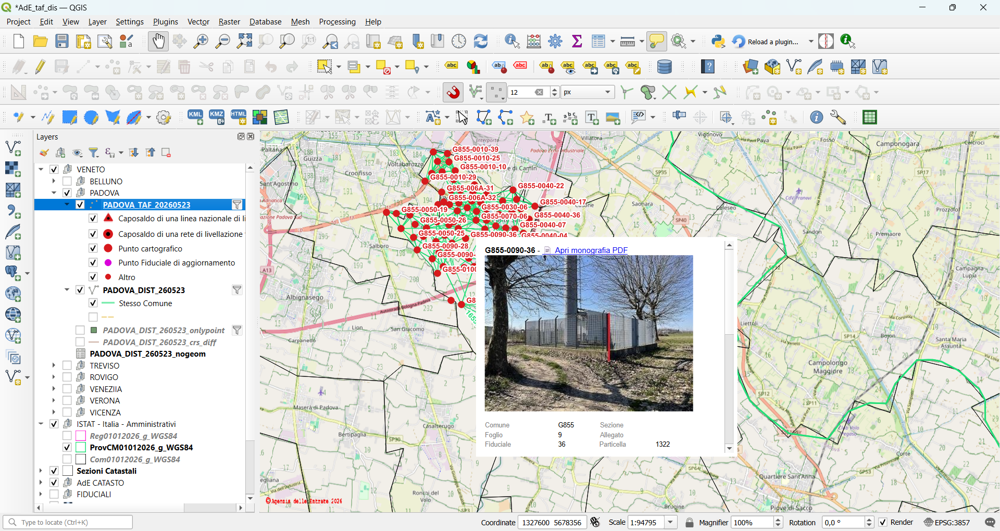&nbsp;&nbsp;&nbsp;
</div>

---

## Indice

1. [Operazioni preliminari](#1-operazioni-preliminari)
2. [Variabili di progetto QGIS](#2-variabili-di-progetto-qgis)
3. [CRS Cassini-Soldner in QGIS](#3-coordinate-reference-system-crs-cassini-soldner-in-qgis)
4. [Azioni QGIS per l'automatizzazione](#4-azioni-qgis-per-lautomatizzazione)
5. [Conclusioni](#5-conclusioni)

---

## 1. Operazioni preliminari

### a) Prerequisiti Python

Per poter eseguire il download e il parsing dei file PDF è necessaria l'installazione di alcune librerie Python. L'operazione va eseguita **una sola volta** da **OSGeo4W Shell**:

```bash
pip install requests beautifulsoup4 pdfplumber pillow
```

### b) Download file TAF e DIS

I file `.TAF` e `.DIS` devono essere scaricati dal sito dell'Agenzia delle Entrate selezionando il proprio *Ufficio Provinciale - Territorio*: [https://www.agenziaentrate.gov.it/portale/lista-uffici](https://www.agenziaentrate.gov.it/portale/lista-uffici)

### c) Installazione degli script Processing `ImportaTAF.py` e `ImportaDIST.py`

I due script Python per la generazione dei GeoPackage devono essere copiati nella cartella del profilo QGIS (Windows):

```
C:\Users\xxxx\AppData\Roaming\QGIS\QGIS3\profiles\default\processing\scripts
```

In alternativa tramite Processing Toolbox di QGIS:
> **Processing Toolbox → ⚙ → Add Script to Toolbox**
<div style="display:flex; gap:1rem; flex-wrap:wrap;">
  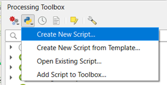&nbsp;&nbsp;&nbsp;
</div><br>

Completata l'operazione, in **Processing Toolbox → Script → Catasto** saranno disponibili i due nuovi tools:
<div style="display:flex; gap:1rem; flex-wrap:wrap;">
  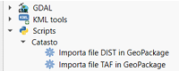&nbsp;&nbsp;&nbsp;
</div><br> 


```
Note sul formato TAF:
Le coordinate Nord/Est dei PF sono metriche e vengono usate come geometria Point. 
Il CRS assegnato di default è EPSG:3003 (Monte Mario Italy zone 1) come punto di partenza ragionevole per l'area italiana. 
Nella realtà i fogli catastali possono usare sistemi misti Gauss-Boaga zona 1/2 o Cassini-Soldner con origine locale per foglio. 
L'utente deve impostare il CRS corretto per il proprio comune dopo l'importazione:  tasto destro layer → Properties → Source → Assigned CRS → Custom CRS → Proj String    

Esempio CRS per il comune: G855 – Ponte San Nicolò
+proj=cass +units=m +k=1 +ellps=bessel +towgs84=518.73805,10.750666,488.892114 +lat_0=45.358967596379 +lon_0=11.8920977331488 +type=crs
```
Viene creato il campo chiave Codice_TAF — esempi:
| Comune | Sezione | Foglio | Allegato | PF id. |Codice TAF |
|---|---|---|---|---|---|
|F842 | | 032 | A |  52   | F842-032A-52  |
|G855 | |  004   | null=0 | 04 | G855-0040-04  |
|E506 | B |  267 | null=0 | 07 | E506B-2670-07 |

In automatico verrà applicato il qml predisposto.

<div style="display:flex; gap:1rem; flex-wrap:wrap;">
  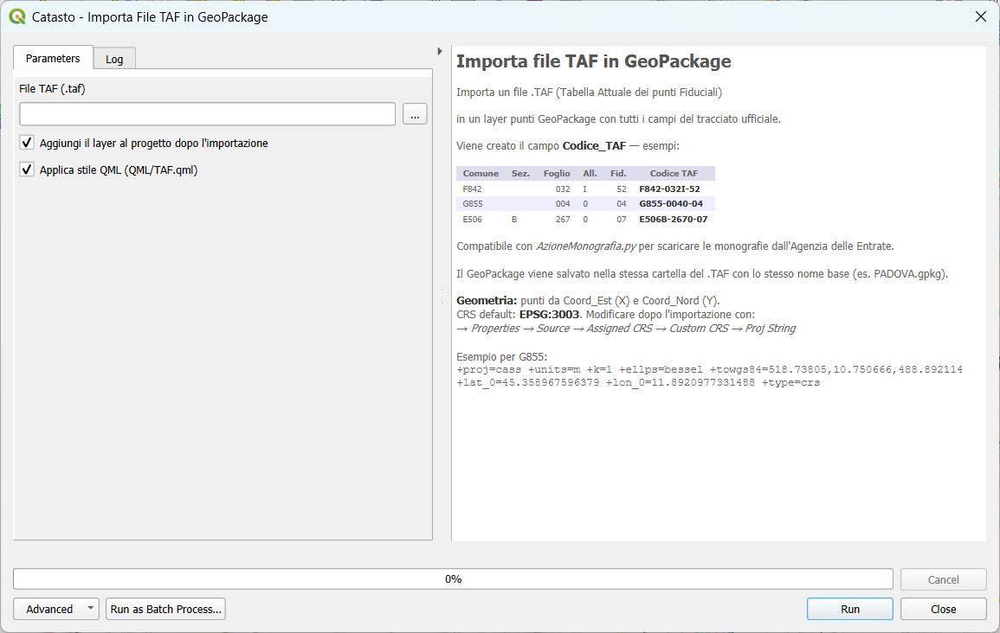&nbsp;&nbsp;&nbsp;
</div><br>

```
Note sul formato DIS:

Le coordinate per la generazione della geometria (LineString / Point) sono ricavate dal corrispondente Codice_TAF  del file .TAF per i due valori TF1 e TF2.
Il CRS delle geometrie viene impostato per default in:
EPSG:3003 Monte Mario / Italy zone 1.

Anche in questi file dovrà essere applicato il corrispondente CRS usato per i TAF per una corretta rappresentazione.

I file _crs_diff non hanno nessun utilizzo pratico in quanto geometricamente errati. Sono stati comunque generati a titolo informativo a verifica delle distanze con punti in CRS misto.
```
I dati importati nel GeoPackage sono divisi in quattro tabelle:

|File | Geometria | Note |
|---|---|---|
|(nomeDIS) |  LineString | righe con entrambi i PF trovati nel TAF |
|(nomeDIS)_onlypoint |  Point | righe con uno dei due PF mancanti nel TAF |
|(nomeDIS)_crs_diff | LineString | righe con PF1-PF2 con coordinate in CRS differenti (GaussBoaga - CassiniSoldner)|
|(nomeDIS)_nogeom | Tabella | righe con entrambi i PF mancanti nel TAF |

In automatico verrà applicato il qml predisposto.
<div style="display:flex; gap:1rem; flex-wrap:wrap;">
  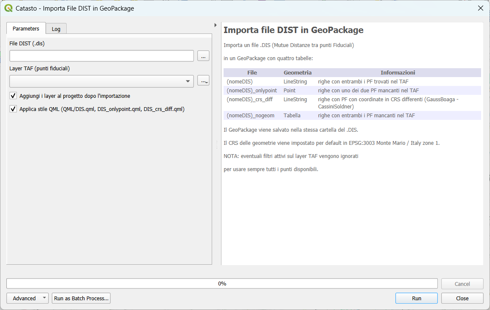&nbsp;&nbsp;&nbsp;
</div><br>

Il nome dei GeoPackage generati sarà uguale al nome del file `.TAF` / `.DIS` di origine e verrà salvato nella stessa cartella.

### d) Cartella QML

Nella cartella del progetto QGIS creare una sottocartella `QML` e inserirvi i seguenti file di stile:

```
QML/
├── TAF.qml
├── DIS.qml
├── DIS_onlypoint.qml
└── DIS_crs_diff.qml
```

Gli stile vengono applicati automaticamente al termine dell'importazione se il checkbox **Applica stile QML** è attivo.

---

## 2. Variabili di Progetto QGIS

Per permettere l'automatizzazione tramite Python scripts attivabili con *Azioni* ai layer di progetto sono necessarie le seguenti variabili di progetto (**Progetto → Proprietà → Variabili**):

| Variabile | Descrizione | Impostata da |
|---|---|---|
| `@TAF_Layer` | Nome del layer TAF attivo | AzioneTAFSetup |
| `@DIS_Layer` | Nome del layer DIS attivo (LineString) | AzioneTAFSetup |
| `@DIS_Layer_onlypoint` | Nome del layer DIS onlypoint | AzioneTAFSetup |
| `@TAF_Comune` | Codice comune catastale corrente (es. `G855`) | AzioneSezioneComune |
| `@PROJ4` | Stringa PROJ4 del CRS corrente | AzioneSezioneComune |
| `@TAF_download` | Cartella locale per PDF e JPG delle monografie | **Manuale** |

> ⚠️ **Al primo avvio del progetto** aggiornare subito `@TAF_download` con il percorso corretto della propria struttura di cartelle dove memorizzare PDF e JPG.

---

## 3. Coordinate Reference System (CRS) Cassini-Soldner in QGIS

Per rappresentare correttamente in QGIS una FeatureClass con geometria espressa in Cassini-Soldner occorre ricostruire la stringa PROJ da usare come CRS personalizzato, in riferimento al punto origine locale:

+proj=cass +units=m +k=1 +ellps=**ELLISSOIDE** +towgs84=**DATUM_PARAM** +lat_0=**LAT_ORIGINE** +lon_0=**LON_ORIGINE** +x_0=**SHIFT_X** +y_0=**SHIFT_Y**


Non esiste un unico CRS per la cartografia catastale italiana rappresentata in Cassini-Soldner in quanto ogni foglio/area catastale può avere un proprio specifico Punto di Origine.

Un interessante articolo di riferimento è:

> **GEODETIC DATUMS OF THE ITALIAN CADASTRAL SYSTEMS**
> Gábor TIMÁR, Valerio BAIOCCHI, Keti LELO
> *Geographia Technica*, No. 1, 2011, pp. 82–90
> [https://www.researchgate.net/publication/233406023](https://www.researchgate.net/publication/233406023_Geodetic_datums_of_the_Italian_cadastral_systems)

Mentre per le **Grandi Origini Catastali** è disponibile molta letteratura e dati reperibili in rete, per le migliaia di **Origini Locali Catastali** i dati disponibili sono frammentati o contraddittori.

### Layer SEZIONI da ArcGIS REST

Ricercando in rete ho trovato una risorsa molto ricca raggiungibile da QGIS come **ArcGIS REST Server Connection**:

```
https://cartografia.globogis.it/arcgis/rest/services/Fiduciali/Punti_fiduciali/MapServer
```

<div style="display:flex; gap:1rem; flex-wrap:wrap;">
  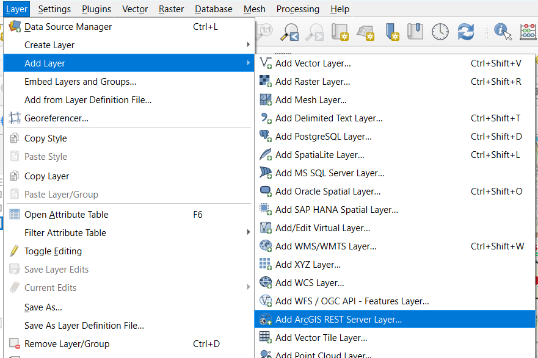&nbsp;&nbsp;&nbsp;
</div><br>
<div style="display:flex; gap:1rem; flex-wrap:wrap;">
  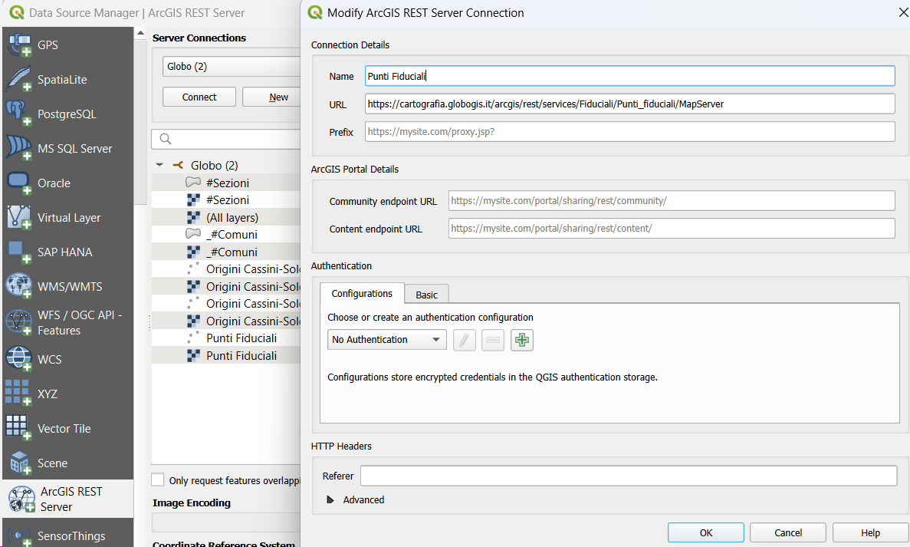&nbsp;&nbsp;&nbsp;
</div><br>
Tra le varie FeatureClass disponibili, risulta molto interessante il layer **SEZIONI** che nel campo **`proj4_cxf`** contiene la stringa PROJ necessaria per applicare il CRS personalizzato ai GeoPackage TAF e DIS.
<br>
.

> **Nota:** per uso personale ho scaricato la FeatureClass SEZIONI sostituendo in `proj4_cxf` la stringa PROJ relativa a Gauss-Boaga est/ovest con `EPSG:3003` o `EPSG:3004` per comodità in QGIS, che li riconosce direttamente dal proprio dizionario interno.


---

## 4. Azioni QGIS per l'automatizzazione

In questo paragrafo si descrive il *cuore* di tutto il processo di visualizzazione.

---

### 4a) TAF-DIS Setup — `AzioneTAFSetup.py`

**Layer:** Sezioni Catastali (`sezioni`)

Nel form dialog si selezionano i tre layer TAF e DIS per la provincia di lavoro, scegliendoli fra quelli già caricati nel progetto QGIS.

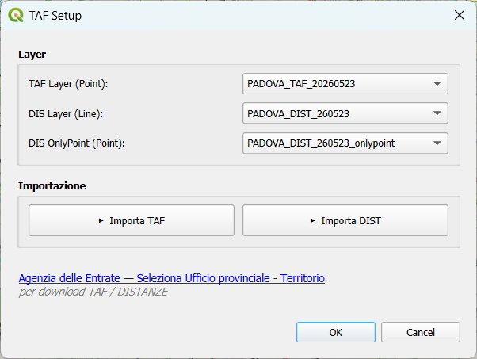

I due pulsanti **Importa TAF** e **Importa DIS** mandano in esecuzione i Processing Tools per la generazione dei GeoPackage. I file prodotti vengono caricati nel progetto QGIS con la propria configurazione ottenuta dai QML predisposti:
`QML/TAF.qml`, `QML/DIS.qml`, `QML/DIS_onlypoint.qml`, `QML/DIS_crs_diff.qml`

I nomi dei tre layer vengono salvati nelle variabili di progetto: `@TAF_Layer`, `@DIS_Layer`, `@DIS_Layer_onlypoint`

---

### 4b) Filtra Comune + CRS — `AzioneSezioneComune.py`

**Layer:** Sezioni Catastali (`sezioni`)
**Scope:** Feature

Con questo script (click con il mouse su un'area presente nel layer) viene selezionato il codice comune catastale di lavoro (es. `G855`) e il relativo CRS PROJ personalizzato. Tali valori vengono applicati ai layer specificati in `@TAF_Layer`, `@DIS_Layer`, `@DIS_Layer_onlypoint` applicando il filtro da `@TAF_Comune`.

Il risultato dell'azione è visibile nella **MessageBar** di QGIS.


> **Tip — Zoom automatico:**
> Per abilitare lo zoom automatico sull'estensione dei TAF selezionati, cercare nel codice il blocco `_applica` del layer TAF e sostituire:
> ```python
> ok_taf = _applica(taf_layer_name, filtro_taf, crs_nuovo, zoom=False)
> ```
> con:
> ```python
> ok_taf = _applica(taf_layer_name, filtro_taf, crs_nuovo, zoom=True)
> ```

---

### 4c) Scarica Monografia e Foto — `AzioneMonografiaLight.py`

**Layer:** TAF (es. `PADOVA_TAF_20260523`)
**Scope:** Feature

Normalmente per eseguire il download della monografia occorre seguire la procedura al link:
[https://www1.agenziaentrate.gov.it/servizi/Monografie/ricerca.php](https://www1.agenziaentrate.gov.it/servizi/Monografie/ricerca.php)

Con questa azione (click con il mouse su un PF) viene eseguito il **download diretto della monografia PDF** del PF selezionato (`Codice_TAF`).

Dal PDF viene estratta la prima foto presente, che viene salvata come JPG con lo stesso nome del PF nella cartella `@TAF_download`. Il percorso completo del file viene salvato nel campo **Foto**.

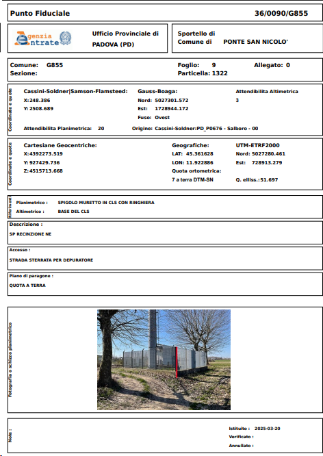

---

### 4d) Scarica e Popola Monografia — `AzioneMonografia.py`

**Layer:** TAF (es. `PADOVA_TAF_20260523`)
**Scope:** Feature

Esegue le stesse funzioni del precedente, ma tenta inoltre di eseguire il **parsing di alcuni dati** presenti nelle monografie e aggiorna i corrispondenti campi del layer TAF (coordinate GB, LAT/LON, date, note, ecc.).
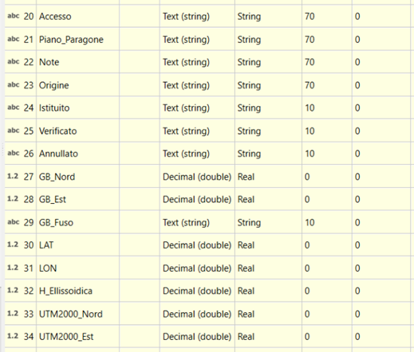<br>

> ⚠️ Funzione sperimentale — non testata su tutte le tipologie di monografia.

---

### Display HTML Map Tip

Nel layer TAF è predisposto con un Map Tip HTML che mostra la foto della monografia e un link al PDF al passaggio del mouse sul punto:

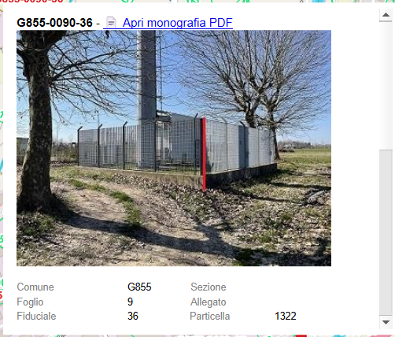

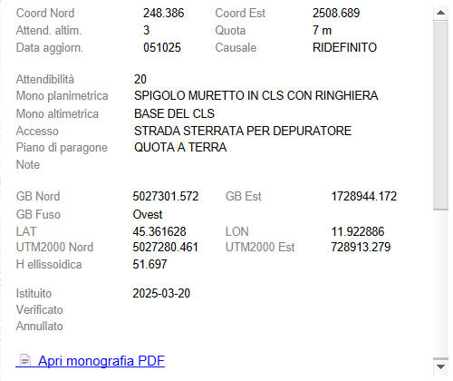

```html
<style type="text/css"> 
ul { 
  margin: 0px; 
  padding: 0px; 
  } 
li { 
  width: 360px; 
  height: 240px; 
  margin: 0px 0px 0px 0px; 
  } 
img { 
  max-width: 100%; 
  max-height: 100%; 
  } 
</style>  
<div style="font-family: sans-serif; font-size: 12px; max-width: 450px;  max-height: 310px;padding: 8px; overflow-y: scroll;">
   <B> [% "Codice_TAF" %] </b> - 
[% if( "Foto" = 'None',
     '<a href=file:///' + @TAF_download + '\\' + "Codice_TAF" + '.pdf>📄 Apri monografia PDF</a>',
   if("Foto" ,
     '<a href=file:///' + replace("Foto", '.jpg', '.pdf') + '>📄 Apri monografia PDF</a>',
   ''))
%]<br>
[% if("Foto" is not null and "Foto" != 'None',
   '<ul><li><a href=file:///' + "Foto" + '></a></li></ul><br>',
   '') %]
  <table style="border-collapse: collapse; width: 100%;font-family: sans-serif; font-size:10px;">
    <tr><td style="color: gray; padding: 2px 6px 2px 0;">Comune</td><td>[% "Codice_Comune" %]</td><td style="color: gray; ">Sezione</td><td>[% "Codice_Sezione" %]</td</tr>
    <tr><td style="color: gray; padding: 2px 6px 2px 0;">Foglio</td><td>[% "Foglio" %]</td><td style="color: gray; ">Allegato</td><td>[% "Allegato" %]</td</tr>
	<tr><td style="color: gray; padding: 2px 6px 2px 0;">Fiduciale</td><td>[% "Fiduciale" %]</td><td style="color: gray; padding: 2px 6px 2px 0;">Particella</td><td>[% "Particella" %]</td></tr>
    <tr><td colspan="2" style="padding: 4px 0;"><hr style="border: 1px solid ; border-top: 1px solid #eee; margin: 0;"/></td></tr>
    <tr><td style="color: gray; padding: 2px 6px 2px 0;">Coord Nord</td><td>[% "Coord_Nord" %]</td><td style="color: gray; padding: 2px 6px 2px 0;">Coord Est</td><td>[% "Coord_Est" %]</td></tr>
	<tr><td style="color: gray; padding: 2px 6px 2px 0;">Attend. altim.</td><td>[% "Attend_Altim" %]</td><td style="color: gray; padding: 2px 6px 2px 0;">Quota</td><td>[% "Quota" %] m</td></tr>
    <tr><td style="color: gray; padding: 2px 6px 2px 0;">Data aggiorn.</td><td>[% "Data_Aggiorn" %]</td><td style="color: gray; padding: 2px 6px 2px 0;">Causale</td><td>[% "Causale_Aggiorn" %]</td></tr>
  </table>
  <hr>
  <table style="border-collapse: collapse; width: 100%;font-family: sans-serif; font-size:10px;">
    <tr><td style="color: gray; padding: 2px 6px 2px 0;">Attendibilità</td><td>[% "Attendibilita" %]</td></tr>
    <tr><td style="color: gray; padding: 2px 6px 2px 0;">Mono planimetrica</td><td>[% "Mono_Planimetrica" %]</td></tr>
    <tr><td style="color: gray; padding: 2px 6px 2px 0;">Mono altimetrica</td><td>[% "Mono_Altimetrica" %]</td></tr>
    <tr><td style="color: gray; padding: 2px 6px 2px 0;">Accesso</td><td>[% "Accesso" %]</td></tr>
    <tr><td style="color: gray; padding: 2px 6px 2px 0;">Piano di paragone</td><td>[% "Piano_Paragone" %]</td></tr>
    <tr><td style="color: gray; padding: 2px 6px 2px 0;">Note</td><td>[% "Note" %]</td></tr>
  </table>
  <hr>
  <table style="border-collapse: collapse; width: 100%;font-family: sans-serif; font-size:10px;">
    <tr><td style="color: gray; padding: 2px 6px 2px 0;">GB Nord</td><td>[% "GB_Nord" %]</td><td style="color: gray; padding: 2px 6px 2px 0;">GB Est</td><td>[% "GB_Est" %]</td></tr>
    <tr><td style="color: gray; padding: 2px 6px 2px 0;">GB Fuso</td><td>[% "GB_Fuso" %]</td></tr>
    <tr><td style="color: gray; padding: 2px 6px 2px 0;">LAT</td><td>[% "LAT" %]</td><td style="color: gray; padding: 2px 6px 2px 0;">LON</td><td>[% "LON" %]</td></tr>
    <tr><td style="color: gray; padding: 2px 6px 2px 0;">UTM2000 Nord</td><td>[% "UTM2000_Nord" %]</td><td style="color: gray; padding: 2px 6px 2px 0;">UTM2000 Est</td><td>[% "UTM2000_Est" %]</td></tr>
    <tr><td style="color: gray; padding: 2px 6px 2px 0;">H ellissoidica</td><td>[% "H_Ellissoidica" %]</td></tr>
    <tr><td colspan="2" style="padding: 4px 0;"><hr style="border: 1px solid ; border-top: 1px solid #eee; margin: 0;"/></td></tr>
    <tr><td style="color: gray; padding: 2px 6px 2px 0;">Istituito</td><td>[% "Istituito" %]</td></tr>
    <tr><td style="color: gray; padding: 2px 6px 2px 0;">Verificato</td><td>[% "Verificato" %]</td></tr>
    <tr><td style="color: gray; padding: 2px 6px 2px 0;">Annullato</td><td>[% "Annullato" %]</td></tr>
  </table>
  <div style="margin-top: 8px; padding-top: 6px; border-top: 1px solid #eee;">
[% if( "Foto" = 'None',
     '<a href=file:///' + @TAF_download + '\\' + "Codice_TAF" + '.pdf>📄 Apri monografia PDF</a>',
   if("Foto" ,
     '<a href=file:///' + replace("Foto", '.jpg', '.pdf') + '>📄 Apri monografia PDF</a>',
   ''))
%]
  </div>
</div>
```

---

## 5. Conclusioni

Spero di essere stato esaustivo nell'illustrare le funzionalità implementate nel progetto QGIS.

Ogni suggerimento o miglioria è ben accetto.

Buon lavoro.

*Giugno 2026 — Mauro Bettella*

---

### Licenza

[GNU General Public License v3.0](https://www.gnu.org/licenses/quick-guide-gplv3.html)

### Riferimenti

- [Agenzia delle Entrate - Tabella Attuale dei punti Fiduciali](https://www.agenziaentrate.gov.it/portale/Schede/FabbricatiTerreni/Punti+fiduciali/Tabella+attuale+dei+punti+fiduciali)
- [Agenzia delle Entrate - Mutue DIStanze dei punti Fiduciali](https://www.agenziaentrate.gov.it/portale/Schede/FabbricatiTerreni/Punti+fiduciali/Mutue+distanze+dei+punti+fiduciali)
- [Agenzia delle Entrate - Uffici Provinciali Territorio](https://www.agenziaentrate.gov.it/portale/lista-uffici)
- [Agenzia delle Entrate - Ricerca Monografie](https://www1.agenziaentrate.gov.it/servizi/Monografie/ricerca.php)

- [Timár G., Baiocchi V., Lelo K. (2011) — *Geodetic Datums of the Italian Cadastral Systems* — Geographia Technica, No. 1, pp. 82–90](https://www.researchgate.net/publication/233406023_Geodetic_datums_of_the_Italian_cadastral_systems)
- [borneo.name — Origini Locali Cassini-Soldner](https://www.borneo.name/coordinate/origini-locali)
